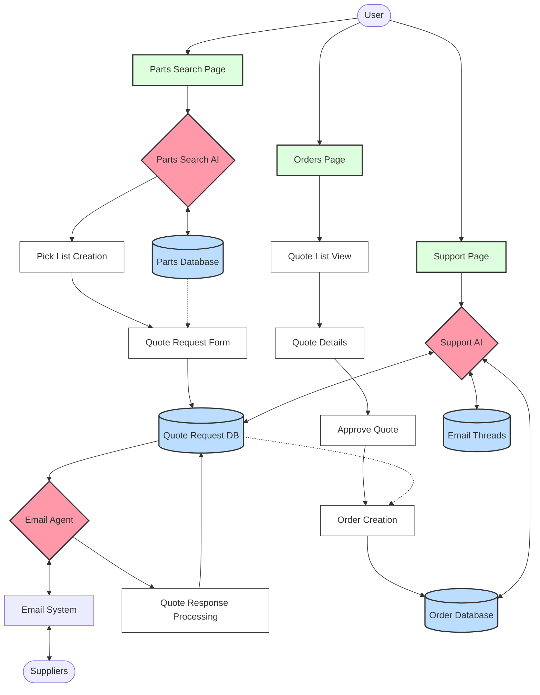

# AI Interaction System: Data Flow and Process Diagram

This document outlines the complete flow of the AI interaction system, focusing on the journey from part identification to quote request to order confirmation.

## 1. System Components

### Parts Search AI Chat
- **Location**: Parts search page
- **Purpose**: Help users identify and find parts
- **Integration**: Direct integration with parts database and n8n webhooks

### Email Agent (No Chat UI)
- **Location**: Backend service
- **Purpose**: Handle quote requests and supplier communications
- **Integration**: Email system, quote request database

### Customer Support AI Chat
- **Location**: Customer support/help page
- **Purpose**: Provide support and retrieve information from communications
- **Integration**: Access to order history, supplier communications

## 2. Data Flow Diagram

## 3. Detailed Process Flow

### Phase 1: Part Identification

1. **User Initiates Part Search**
   - User navigates to parts search page
   - User describes part needs in natural language
   - Parts Search AI processes the request

2. **AI-Assisted Part Identification**
   - Parts Search AI queries parts database
   - AI presents matching parts with details
   - User selects desired parts
   - System adds parts to pick list

### Phase 2: Quote Request Process

3. **Quote Request Creation**
   - User reviews pick list and initiates quote request
   - User selects suppliers and provides requirements
   - System creates quote request record in database
   - Email Agent generates quote request email

4. **Email Processing**
   - Email Agent sends quote request to suppliers
   - System stores outbound email content
   - Email Agent monitors for responses
   - When response received, system stores inbound email

5. **Quote Response Processing**
   - Email Agent extracts key information from supplier responses
   - System updates quote request with pricing and availability
   - User is notified of received quotes

### Phase 3: Quote Review and Order Creation

6. **Quote Review**
   - User navigates to Orders page and views Quote Requests
   - User reviews quote details including:
     - Part information
     - Pricing
     - Delivery terms
     - Extracted data from supplier emails

7. **Quote Approval Process**
   - User approves preferred quote
   - System presents order confirmation form
   - User confirms order details
   - System converts quote to order

8. **Order Processing**
   - System generates purchase order
   - Email Agent sends order confirmation to supplier
   - System stores all communication in email thread
   - Order is tracked through fulfillment process

### Phase 4: Support and Information Retrieval

9. **Support Interactions**
   - User can ask Customer Support AI about orders or quotes
   - Support AI accesses order database and email threads
   - AI provides relevant information and context
   - AI can summarize communication history

## 4. Key Data Entities and Relationships

### Email Thread
- Central record of all communications related to a quote or order
- Contains both outbound and inbound messages
- Linked to suppliers, quote requests, and orders
- Stores full email content for reference

### Quote Request
- Created from parts pick list
- Contains requested items with quantities
- Linked to email thread for communication history
- Tracks status from draft through approval or rejection

### Order
- Created when quote is approved
- References original quote request
- Linked to email thread for ongoing communications
- Tracks fulfillment status

## 5. AI Agent Responsibilities

### Parts Search AI
- Natural language understanding for part descriptions
- Matching user needs to available parts
- Suggesting alternatives and related items
- Supporting pick list creation

### Email Agent
- Generating professional quote request emails
- Monitoring for supplier responses
- Extracting key information from emails
- Preparing follow-up emails for user approval
- Sending order confirmations

### Customer Support AI
- Retrieving order and quote information
- Summarizing communication history
- Answering questions about order status
- Providing context from supplier communications

## 6. Implementation Considerations

### Data Privacy and Security
- Email content must be securely stored
- Access controls for sensitive supplier communications
- Encryption for stored email content

### AI Training and Improvement
- Continuous learning from successful interactions
- Feedback loop for improving email parsing accuracy
- Regular updates to natural language understanding capabilities

### Integration Points
- Email system integration (SMTP/IMAP)
- Parts database connectivity
- Order management system
- User notification system