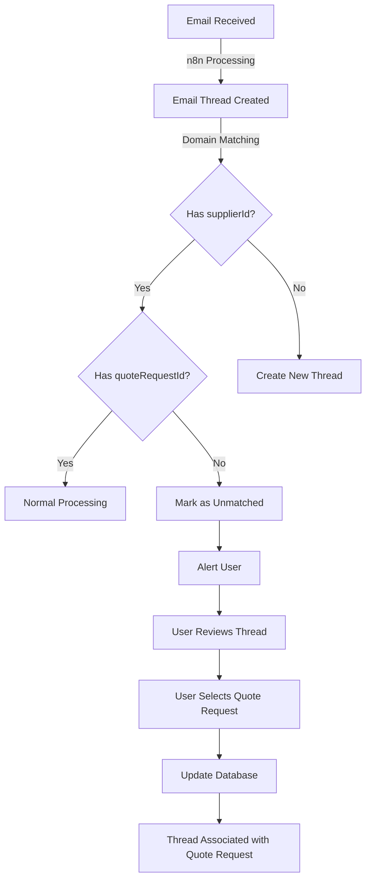

# Email Thread Matching System

## Overview

The Email Thread Matching System is designed to handle scenarios where emails from different representatives of the same supplier need to be associated with the correct quote requests. This is particularly important when dealing with group email addresses (e.g., partscenter@demosupplier.com) where individual representatives might reply from their personal email addresses (e.g., john.smith@demosupplier.com).

## Problem Statement

When a supplier representative replies from an email address different from the one the original message was sent to, the system correctly identifies the supplier (based on domain matching) but cannot automatically associate the email with the relevant quote request. This results in "orphaned" email threads that have a `supplierId` but no `quoteRequestId`.

Example:
```
"id": "19932709b7b376a1",
"subject": "This is a new thread branch",
"externalThreadId": "19932709b7b376a1",
"status": "FOLLOW_UP_NEEDED",
"organizationId": "cmfai1bgh00007zu5pl0e0ynh",
"supplierId": "cmfass2o900089316r3h2w8yp",
"quoteRequestId": null,
"createdById": "cmfai1dje00047zu5xdhhfny3",
"createdAt": "2025-09-10 08:15:17.689",
"updatedAt": "2025-09-10 08:15:17.689"
```

## Solution Architecture

The solution consists of:

1. **Detection System**: Identifies email threads with a supplier ID but no quote request ID
2. **Alert System**: Notifies users about unmatched threads
3. **Matching Interface**: Allows users to review and match threads to quote requests
4. **Database Updates**: Associates matched threads with the correct quote requests

### System Flow



## Database Schema

The system uses the existing database schema with these key models:

### EmailThread Model

```prisma
model EmailThread {
  id              String          @id @default(cuid())
  subject         String
  externalThreadId String?        // External email thread ID for tracking
  status          EmailThreadStatus
  
  // Organization Context
  organization    Organization    @relation(fields: [organizationId], references: [id], onDelete: Cascade)
  organizationId  String
  
  // Relationships
  supplier        Supplier?       @relation(fields: [supplierId], references: [id])
  supplierId      String?
  quoteRequest    QuoteRequest?   @relation(fields: [quoteRequestId], references: [id])
  quoteRequestId  String?         @unique
  order           Order?
  
  // Content
  messages        EmailMessage[]
  
  // Metadata
  createdBy       User            @relation(fields: [createdById], references: [id])
  createdById     String
  createdAt       DateTime        @default(now())
  updatedAt       DateTime        @updatedAt
  
  @@index([organizationId])
  @@index([supplierId])
  @@index([status])
  @@map("email_threads")
}
```

### EmailMessage Model

```prisma
model EmailMessage {
  id              String          @id @default(cuid())
  thread          EmailThread     @relation(fields: [threadId], references: [id], onDelete: Cascade)
  threadId        String
  
  // Message Details
  direction       EmailDirection
  from            String
  to              String
  cc              String[]        @default([])
  bcc             String[]        @default([])
  subject         String
  body            String          @db.Text
  bodyHtml        String?         @db.Text
  
  // Email Metadata
  externalMessageId String?       // ID from email provider
  sentAt          DateTime?
  receivedAt      DateTime?
  
  // Follow-up Fields
  expectedResponseBy DateTime?    // When a response is expected by
  followUpSentAt   DateTime?      // When a follow-up was sent
  inReplyTo        String?        // ID of the message this is replying to
  
  // Attachments
  attachments     EmailAttachment[]
  
  // Timestamps
  createdAt       DateTime        @default(now())
  updatedAt       DateTime        @updatedAt
  
  @@index([threadId])
  @@index([inReplyTo])
  @@map("email_messages")
}
```

### Supplier Model with Auxiliary Emails

To store multiple email addresses for each supplier, update the Supplier model:

```prisma
model Supplier {
  id              String         @id @default(cuid())
  supplierId      String         // SUP-001, SUP-002
  name            String
  type            SupplierType
  status          SupplierStatus @default(ACTIVE)
  
  organization    Organization   @relation(fields: [organizationId], references: [id], onDelete: Cascade)
  organizationId  String
  
  // Contact Information
  contactPerson   String?
  email           String?        // Primary email address
  auxiliaryEmails String[]       // Array of additional email addresses
  phone           String?
  website         String?
  
  // Address
  address         String?
  city            String?
  state           String?
  zipCode         String?
  country         String?        @default("USA")
  
  // Performance Metrics
  rating          Decimal?       @db.Decimal(3,2) // 0.00 to 5.00
  deliveryRating  Decimal?       @db.Decimal(3,2)
  qualityRating   Decimal?       @db.Decimal(3,2)
  avgDeliveryTime Int?           // Days
  
  // Business Information
  paymentTerms    String?        // Net 30, Net 60, etc.
  taxId           String?
  certifications  Json?          // ISO, etc.
  specialties     Json?          // Array of specialties
  
  // Timestamps
  createdAt       DateTime       @default(now())
  updatedAt       DateTime       @updatedAt
  
  // Relations
  orders          Order[]
  parts           PartSupplier[]
  emailThreads    EmailThread[]
  quoteRequests   QuoteRequest[]
  
  @@unique([organizationId, supplierId])
  @@map("suppliers")
  @@index([organizationId])
}
```

## API Endpoints

### 1. Fetch Unmatched Threads

```typescript
// GET /api/email-threads/unmatched
// Returns all email threads with a supplierId but no quoteRequestId

export async function GET(req: NextRequest) {
  try {
    const session = await auth();
    
    if (!session?.user) {
      return NextResponse.json({ error: "Unauthorized" }, { status: 401 });
    }
    
    // Get all email threads with a supplierId but no quoteRequestId
    const unmatchedThreads = await prisma.emailThread.findMany({
      where: {
        organizationId: session.user.organizationId,
        supplierId: { not: null },
        quoteRequestId: null
      },
      include: {
        supplier: {
          select: {
            id: true,
            name: true,
            email: true
          }
        },
        messages: {
          take: 1,
          orderBy: {
            createdAt: 'asc'
          }
        }
      },
      orderBy: {
        createdAt: 'desc'
      }
    });
    
    return NextResponse.json({
      success: true,
      threads: unmatchedThreads
    });
  } catch (error) {
    console.error("Error fetching unmatched threads:", error);
    return NextResponse.json(
      { error: "Failed to fetch unmatched threads" },
      { status: 500 }
    );
  }
}
```

### 2. Count Unmatched Threads

```typescript
// GET /api/email-threads/unmatched/count
// Returns the count of unmatched threads

export async function GET(req: NextRequest) {
  try {
    const session = await auth();
    
    if (!session?.user) {
      return NextResponse.json({ error: "Unauthorized" }, { status: 401 });
    }
    
    // Count email threads with a supplierId but no quoteRequestId
    const count = await prisma.emailThread.count({
      where: {
        organizationId: session.user.organizationId,
        supplierId: { not: null },
        quoteRequestId: null
      }
    });
    
    return NextResponse.json({
      success: true,
      count
    });
  } catch (error) {
    console.error("Error counting unmatched threads:", error);
    return NextResponse.json(
      { error: "Failed to count unmatched threads" },
      { status: 500 }
    );
  }
}
```

### 3. Fetch Quote Requests by Suppliers

```typescript
// POST /api/quote-requests/by-suppliers
// Returns quote requests for specified suppliers

export async function POST(request: NextRequest) {
  try {
    const session = await auth();
    
    if (!session?.user) {
      return NextResponse.json({ error: "Unauthorized" }, { status: 401 });
    }
    
    const { supplierIds } = await request.json();
    
    if (!supplierIds || !Array.isArray(supplierIds) || supplierIds.length === 0) {
      return NextResponse.json(
        { error: "Invalid supplierIds" },
        { status: 400 }
      );
    }
    
    // Get quote requests for the specified suppliers
    const quoteRequests = await prisma.quoteRequest.findMany({
      where: {
        organizationId: session.user.organizationId,
        supplierId: { in: supplierIds },
        // Exclude converted or cancelled quote requests
        status: {
          notIn: ['CONVERTED_TO_ORDER', 'CANCELLED']
        }
      },
      orderBy: {
        updatedAt: 'desc'
      }
    });
    
    return NextResponse.json({
      success: true,
      quoteRequests
    });
  } catch (error) {
    console.error("Error fetching quote requests by suppliers:", error);
    return NextResponse.json(
      { error: "Failed to fetch quote requests" },
      { status: 500 }
    );
  }
}
```

### 4. Match Thread to Quote Request

```typescript
// POST /api/email-threads/[id]/match
// Associates an email thread with a quote request

export async function POST(
  request: NextRequest,
  { params }: { params: { id: string } }
) {
  try {
    const threadId = params.id;
    const session = await auth();
    
    if (!session?.user) {
      return NextResponse.json({ error: "Unauthorized" }, { status: 401 });
    }
    
    const { quoteRequestId } = await request.json();
    
    if (!quoteRequestId) {
      return NextResponse.json(
        { error: "Missing quoteRequestId" },
        { status: 400 }
      );
    }
    
    // Verify the thread exists and belongs to the user's organization
    const thread = await prisma.emailThread.findFirst({
      where: {
        id: threadId,
        organizationId: session.user.organizationId,
      },
    });
    
    if (!thread) {
      return NextResponse.json(
        { error: "Thread not found or access denied" },
        { status: 404 }
      );
    }
    
    // Verify the quote request exists and belongs to the user's organization
    const quoteRequest = await prisma.quoteRequest.findFirst({
      where: {
        id: quoteRequestId,
        organizationId: session.user.organizationId,
      },
    });
    
    if (!quoteRequest) {
      return NextResponse.json(
        { error: "Quote request not found or access denied" },
        { status: 404 }
      );
    }
    
    // Update the thread to associate it with the quote request
    const updatedThread = await prisma.emailThread.update({
      where: { id: threadId },
      data: {
        quoteRequestId,
        // Update the status based on the quote request status
        status: mapQuoteStatusToThreadStatus(quoteRequest.status),
      },
    });
    
    // Log the activity
    await prisma.activityLog.create({
      data: {
        type: 'QUOTE_REQUESTED',
        title: 'Email Thread Matched',
        description: `Email thread "${thread.subject}" matched to quote request ${quoteRequest.quoteNumber}`,
        entityType: 'EmailThread',
        entityId: threadId,
        userId: session.user.id,
        organizationId: session.user.organizationId,
        metadata: {
          quoteRequestId,
          threadId,
          supplierId: thread.supplierId,
        },
      },
    });
    
    return NextResponse.json({
      success: true,
      thread: updatedThread,
    });
  } catch (error) {
    console.error("Error matching thread:", error);
    return NextResponse.json(
      { error: "Failed to match thread" },
      { status: 500 }
    );
  }
}

// Helper function to map quote status to thread status
function mapQuoteStatusToThreadStatus(quoteStatus: string) {
  switch (quoteStatus) {
    case 'DRAFT':
      return 'DRAFT';
    case 'SENT':
      return 'SENT';
    case 'RECEIVED':
      return 'RESPONSE_RECEIVED';
    case 'UNDER_REVIEW':
      return 'RESPONSE_RECEIVED';
    case 'APPROVED':
      return 'COMPLETED';
    case 'REJECTED':
      return 'COMPLETED';
    case 'EXPIRED':
      return 'COMPLETED';
    case 'CONVERTED_TO_ORDER':
      return 'CONVERTED_TO_ORDER';
    default:
      return 'WAITING_RESPONSE';
  }
}
```

### 5. Add Auxiliary Email to Supplier

```typescript
// POST /api/suppliers/[id]/emails
// Adds a new auxiliary email to a supplier

export async function POST(
  request: NextRequest,
  { params }: { params: { id: string } }
) {
  try {
    const supplierId = params.id;
    const session = await auth();
    
    if (!session?.user) {
      return NextResponse.json({ error: "Unauthorized" }, { status: 401 });
    }
    
    const { email } = await request.json();
    
    if (!email) {
      return NextResponse.json(
        { error: "Email is required" },
        { status: 400 }
      );
    }
    
    // Verify the supplier exists and belongs to the user's organization
    const supplier = await prisma.supplier.findFirst({
      where: {
        id: supplierId,
        organizationId: session.user.organizationId,
      },
    });
    
    if (!supplier) {
      return NextResponse.json(
        { error: "Supplier not found or access denied" },
        { status: 404 }
      );
    }
    
    // Check if the email already exists in auxiliaryEmails
    const auxiliaryEmails = supplier.auxiliaryEmails || [];
    if (auxiliaryEmails.includes(email)) {
      return NextResponse.json(
        { error: "Email already exists for this supplier" },
        { status: 400 }
      );
    }
    
    // Add the new email to auxiliaryEmails
    const updatedSupplier = await prisma.supplier.update({
      where: { id: supplierId },
      data: {
        auxiliaryEmails: {
          push: email
        }
      },
    });
    
    return NextResponse.json({
      success: true,
      supplier: updatedSupplier,
    });
  } catch (error) {
    console.error("Error adding supplier email:", error);
    return NextResponse.json(
      { error: "Failed to add supplier email" },
      { status: 500 }
    );
  }
}
```

## Frontend Components

### 1. Unmatched Threads Alert

```tsx
// components/ui/unmatched-threads-alert.tsx
import { useState, useEffect } from "react";
import { Alert, AlertTitle, AlertDescription } from "@/components/ui/alert";
import { Button } from "@/components/ui/button";
import { Badge } from "@/components/ui/badge";
import { Mail, AlertTriangle } from "lucide-react";
import { useRouter } from "next/navigation";

export function UnmatchedThreadsAlert() {
  const [unmatchedThreads, setUnmatchedThreads] = useState([]);
  const [loading, setLoading] = useState(true);
  const router = useRouter();
  
  useEffect(() => {
    // Fetch unmatched threads (threads with supplierId but no quoteRequestId)
    async function fetchUnmatchedThreads() {
      try {
        setLoading(true);
        const response = await fetch('/api/email-threads/unmatched');
        const data = await response.json();
        
        if (data.success) {
          setUnmatchedThreads(data.threads);
        }
      } catch (error) {
        console.error("Error fetching unmatched threads:", error);
      } finally {
        setLoading(false);
      }
    }
    
    fetchUnmatchedThreads();
    
    // Set up polling to check for new unmatched threads every 5 minutes
    const interval = setInterval(fetchUnmatchedThreads, 5 * 60 * 1000);
    
    return () => clearInterval(interval);
  }, []);
  
  if (loading || unmatchedThreads.length === 0) {
    return null;
  }
  
  return (
    <Alert variant="warning" className="mb-6">
      <AlertTriangle className="h-4 w-4" />
      <AlertTitle className="flex items-center gap-2">
        Unmatched Email Threads
        <Badge variant="warning">{unmatchedThreads.length}</Badge>
      </AlertTitle>
      <AlertDescription className="mt-2">
        <p className="mb-2">
          There {unmatchedThreads.length === 1 ? 'is' : 'are'} {unmatchedThreads.length} email thread{unmatchedThreads.length === 1 ? '' : 's'} from known suppliers that {unmatchedThreads.length === 1 ? 'needs' : 'need'} to be matched to quote requests.
        </p>
        <Button 
          size="sm" 
          variant="outline" 
          className="mt-2"
          onClick={() => router.push('/emails/unmatched')}
        >
          <Mail className="mr-2 h-4 w-4" />
          Review Unmatched Threads
        </Button>
      </AlertDescription>
    </Alert>
  );
}
```

### 2. Navbar Notification Badge

```tsx
// components/layout/navbar.tsx (partial)
import { useState, useEffect } from "react";
import Link from "next/link";
import { Mail } from "lucide-react";
import { Badge } from "@/components/ui/badge";

export function Navbar() {
  const [unmatchedCount, setUnmatchedCount] = useState(0);
  
  useEffect(() => {
    // Fetch unmatched threads count
    async function fetchUnmatchedCount() {
      try {
        const response = await fetch('/api/email-threads/unmatched/count');
        const data = await response.json();
        
        if (data.success) {
          setUnmatchedCount(data.count);
        }
      } catch (error) {
        console.error("Error fetching unmatched count:", error);
      }
    }
    
    fetchUnmatchedCount();
    
    // Poll for updates every 5 minutes
    const interval = setInterval(fetchUnmatchedCount, 5 * 60 * 1000);
    
    return () => clearInterval(interval);
  }, []);
  
  return (
    <nav className="border-b">
      <div className="container mx-auto px-4 py-2">
        <div className="flex items-center justify-between">
          {/* Logo and main navigation */}
          <div className="flex items-center gap-6">
            {/* ... */}
          </div>
          
          {/* Right side navigation */}
          <div className="flex items-center gap-4">
            <Link href="/emails/unmatched" className="relative">
              <Mail className="h-5 w-5" />
              {unmatchedCount > 0 && (
                <Badge variant="destructive" className="absolute -top-2 -right-2 h-5 w-5 flex items-center justify-center p-0 text-xs">
                  {unmatchedCount}
                </Badge>
              )}
            </Link>
            
            {/* Other navigation items */}
            {/* ... */}
          </div>
        </div>
      </div>
    </nav>
  );
}
```

### 3. Supplier Email Management Component

```tsx
// components/supplier/email-management.tsx
import { useState, useEffect } from "react";
import { Card, CardContent, CardDescription, CardFooter, CardHeader, CardTitle } from "@/components/ui/card";
import { Button } from "@/components/ui/button";
import { Input } from "@/components/ui/input";
import { Label } from "@/components/ui/label";
import { Badge } from "@/components/ui/badge";
import { toast } from "@/components/ui/use-toast";
import { Trash, Plus } from "lucide-react";

export function SupplierEmailManagement({ supplier, onUpdate }) {
  const [newEmail, setNewEmail] = useState("");
  
  const handleAddEmail = async () => {
    if (!newEmail) return;
    
    try {
      const response = await fetch(`/api/suppliers/${supplier.id}/emails`, {
        method: 'POST',
        headers: {
          'Content-Type': 'application/json',
        },
        body: JSON.stringify({ email: newEmail }),
      });
      
      const data = await response.json();
      
      if (data.success) {
        toast({
          title: "Success",
          description: "Email address added successfully",
        });
        
        setNewEmail("");
        onUpdate(data.supplier);
      } else {
        toast({
          title: "Error",
          description: data.error || "Failed to add email address",
          variant: "destructive",
        });
      }
    } catch (error) {
      console.error("Error adding email:", error);
      toast({
        title: "Error",
        description: "Failed to add email address",
        variant: "destructive",
      });
    }
  };
  
  const handleRemoveEmail = async (email) => {
    try {
      const response = await fetch(`/api/suppliers/${supplier.id}/emails/remove`, {
        method: 'POST',
        headers: {
          'Content-Type': 'application/json',
        },
        body: JSON.stringify({ email }),
      });
      
      const data = await response.json();
      
      if (data.success) {
        toast({
          title: "Success",
          description: "Email address removed successfully",
        });
        
        onUpdate(data.supplier);
      } else {
        toast({
          title: "Error",
          description: data.error || "Failed to remove email address",
          variant: "destructive",
        });
      }
    } catch (error) {
      console.error("Error removing email:", error);
      toast({
        title: "Error",
        description: "Failed to remove email address",
        variant: "destructive",
      });
    }
  };
  
  return (
    <Card>
      <CardHeader>
        <CardTitle>Email Addresses</CardTitle>
        <CardDescription>
          Manage email addresses for this supplier
        </CardDescription>
      </CardHeader>
      <CardContent>
        <div className="space-y-4">
          {/* Primary Email */}
          <div className="flex items-center justify-between">
            <div>
              <p className="font-medium">{supplier.email}</p>
              <p className="text-xs text-muted-foreground">Primary Email</p>
            </div>
            <Badge>Primary</Badge>
          </div>
          
          {/* Auxiliary Emails */}
          {supplier.auxiliaryEmails && supplier.auxiliaryEmails.length > 0 && (
            <>
              <div className="border-t pt-4">
                <h4 className="text-sm font-medium mb-2">Additional Emails</h4>
                <div className="space-y-2">
                  {supplier.auxiliaryEmails.map((email, index) => (
                    <div key={index} className="flex items-center justify-between">
                      <p>{email}</p>
                      <Button 
                        variant="ghost" 
                        size="sm" 
                        onClick={() => handleRemoveEmail(email)}
                      >
                        <Trash className="h-4 w-4" />
                      </Button>
                    </div>
                  ))}
                </div>
              </div>
            </>
          )}
          
          {/* Add New Email */}
          <div className="border-t pt-4">
            <h4 className="text-sm font-medium mb-2">Add New Email</h4>
            <div className="flex gap-2">
              <div className="flex-1">
                <Input
                  placeholder="additional@supplier.com"
                  value={newEmail}
                  onChange={(e) => setNewEmail(e.target.value)}
                />
              </div>
              <Button onClick={handleAddEmail} disabled={!newEmail}>
                <Plus className="h-4 w-4 mr-1" />
                Add
              </Button>
            </div>
          </div>
        </div>
      </CardContent>
    </Card>
  );
}
```

### 4. Automatic Email Learning

When processing incoming emails, the system should automatically add new email addresses to the supplier's auxiliaryEmails array:

```typescript
// Function to process incoming email and learn new addresses
async function processIncomingEmail(email) {
  const fromEmail = email.from;
  const fromDomain = extractDomain(fromEmail);
  
  // Try to find the supplier by domain
  const supplier = await findSupplierByDomain(fromDomain);
  
  if (supplier) {
    // Check if this is a new email address for this supplier
    const isKnownEmail = supplier.email === fromEmail || 
                         (supplier.auxiliaryEmails && supplier.auxiliaryEmails.includes(fromEmail));
    
    if (!isKnownEmail) {
      // Add this as a new auxiliary email for the supplier
      await prisma.supplier.update({
        where: { id: supplier.id },
        data: {
          auxiliaryEmails: {
            push: fromEmail
          }
        }
      });
      
      // Create a notification for the user
      await createNotification({
        type: 'NEW_SUPPLIER_EMAIL',
        title: 'New supplier email detected',
        message: `A new email address (${fromEmail}) was detected for ${supplier.name} and has been added to their profile.`,
        entityType: 'Supplier',
        entityId: supplier.id,
        actionUrl: `/suppliers/${supplier.id}/edit`
      });
    }
    
    // Continue processing the email...
  }
}

// Function to find supplier by domain
async function findSupplierByDomain(domain) {
  // First try to find suppliers with matching primary email domain
  const suppliersByPrimaryDomain = await prisma.supplier.findMany({
    where: {
      email: {
        contains: `@${domain}`
      }
    }
  });
  
  if (suppliersByPrimaryDomain.length === 1) {
    return suppliersByPrimaryDomain[0];
  }
  
  // Then try to find suppliers with matching auxiliary email domains
  const suppliersByAuxiliaryDomain = await prisma.supplier.findMany({
    where: {
      auxiliaryEmails: {
        hasSome: [`@${domain}`]
      }
    }
  });
  
  if (suppliersByAuxiliaryDomain.length === 1) {
    return suppliersByAuxiliaryDomain[0];
  }
  
  // If multiple suppliers match or none match, return null
  return null;
}
```

## User Workflow

1. **Email Received**:
   - n8n processes incoming emails and creates email threads in the database
   - Domain matching identifies the supplier based on the email domain
   - The thread is created with a `supplierId` but no `quoteRequestId`
   - If the email is from a new address, it's automatically added to the supplier's auxiliaryEmails

2. **User Notification**:
   - The system detects unmatched threads (threads with `supplierId` but no `quoteRequestId`)
   - A notification badge appears in the navigation bar
   - An alert is displayed on the dashboard

3. **Thread Review**:
   - User clicks on the notification or alert to view unmatched threads
   - The system displays all unmatched threads with their content
   - For each thread, the system shows a dropdown of potential quote requests from the same supplier

4. **Thread Matching**:
   - User selects the appropriate quote request for each thread
   - User clicks "Match Thread" to associate the thread with the selected quote request
   - The system updates the database to link the thread to the quote request

5. **Confirmation**:
   - A success message confirms the thread has been matched
   - The thread is removed from the unmatched threads list
   - The thread now appears in the communication timeline of the associated quote request

## Implementation Steps

1. **Update Database Schema**:
   - Add the `auxiliaryEmails` field to the Supplier model
   - Create a migration to update the database

2. **Create API Endpoints**:
   - Implement the unmatched threads endpoint
   - Implement the thread count endpoint
   - Implement the quote requests by suppliers endpoint
   - Implement the thread matching endpoint
   - Implement the supplier email management endpoints

3. **Create Frontend Components**:
   - Implement the unmatched threads alert component
   - Implement the navbar notification badge
   - Create the unmatched threads page
   - Create the supplier email management component

4. **Update Email Processing**:
   - Enhance the domain matching logic to check both primary and auxiliary emails
   - Implement automatic email learning for new sender addresses

5. **Add Components to Existing Pages**:
   - Add the alert component to the dashboard
   - Add the notification badge to the navbar
   - Add the email management component to the supplier edit page

6. **Testing**:
   - Test with various email scenarios
   - Verify that threads are correctly identified as unmatched
   - Verify that users are properly notified
   - Verify that threads can be matched to quote requests
   - Verify that new email addresses are automatically added to suppliers

## Testing Procedures

1. **Setup Test Environment**:
   - Create test suppliers with different email domains
   - Create test quote requests for these suppliers
   - Ensure n8n is configured to process incoming emails

2. **Test Email Processing**:
   - Send an email from a known supplier domain but from a different email address
   - Verify that n8n correctly processes the email
   - Verify that the email thread is created with the correct `supplierId`
   - Verify that the new email address is automatically added to the supplier's `auxiliaryEmails`

3. **Test Notification System**:
   - Verify that the notification badge appears in the navbar
   - Verify that the alert appears on the dashboard
   - Verify that the count is accurate

4. **Test Matching Interface**:
   - Navigate to the unmatched threads page
   - Verify that all unmatched threads are displayed
   - Verify that the dropdown shows only quote requests for the relevant supplier
   - Select a quote request and click "Match Thread"
   - Verify that the thread is successfully matched

5. **Test Integration**:
   - Navigate to the quote request detail page
   - Verify that the matched thread appears in the communication timeline
   - Verify that the thread status is correctly updated based on the quote request status

6. **Test Supplier Email Management**:
   - Navigate to the supplier edit page
   - Verify that all email addresses (primary and auxiliary) are displayed
   - Add a new email address and verify it's added to the `auxiliaryEmails` array
   - Remove an email address and verify it's removed from the `auxiliaryEmails` array

## Subject Line Reference Codes

To improve email thread matching, we should implement a standardized format for email subject lines that includes the quote request number. This will make it easier to match incoming emails even when they come from different addresses within the same supplier domain.

### Implementation Details

1. **Subject Line Format**:
   ```
   [QR-12345] [CAT-320D-2015] Request for Quote - Part Description
   ```
   Where:
   - `QR-12345` is the quote request number
   - `CAT-320D-2015` is the vehicle information (Make-Model-Year)
   - The rest of the subject describes the purpose and content

2. **Integration with Part Search Page**:
   When a user initiates a quote request from the part search page, the system should automatically generate a subject line with the quote request number prefix.

   ```typescript
   // In the part search to quote request flow
   function createQuoteRequestFromPartSearch(parts, supplier, vehicle) {
     // Create the quote request
     const quoteRequest = await prisma.quoteRequest.create({
       data: {
         // ... other fields
       }
     });
     
     // Format vehicle information
     const vehicleInfo = vehicle
       ? `[${vehicle.make}-${vehicle.model}-${vehicle.year}]`
       : '';
     
     // Generate the email subject with the reference code and vehicle info
     const subject = `[QR-${quoteRequest.quoteNumber}] ${vehicleInfo} Request for Quote - ${parts.length} parts`;
     
     // Use this subject when sending the email
     // ...
   }
   ```

3. **Subject Line Parsing**:
   When receiving emails, the system should parse the subject line to extract the quote request number:

   ```typescript
   function extractEmailMetadata(subject) {
     // Extract quote request number
     const quoteMatch = subject.match(/\[QR-(\d+)\]/);
     const quoteNumber = quoteMatch ? quoteMatch[1] : null;
     
     // Extract vehicle information
     const vehicleMatch = subject.match(/\[([\w-]+)-([\w-]+)-(\d{4})\]/);
     const vehicleInfo = vehicleMatch ? {
       make: vehicleMatch[1],
       model: vehicleMatch[2],
       year: vehicleMatch[3]
     } : null;
     
     return { quoteNumber, vehicleInfo };
   }
   
   async function processIncomingEmail(email) {
     // Extract metadata from subject
     const { quoteNumber, vehicleInfo } = extractEmailMetadata(email.subject);
     
     if (quoteNumber) {
       // Look up the quote request by number
       const quoteRequest = await prisma.quoteRequest.findFirst({
         where: {
           quoteNumber,
           organizationId: email.organizationId
         }
       });
       
       if (quoteRequest) {
         // Associate the email thread with this quote request
         // ...
         return;
       }
     }
     
     // If we have vehicle info but no quote request match, we can use it for additional matching
     if (vehicleInfo && !quoteNumber) {
       // Look for quote requests with matching vehicle
       const quoteRequests = await prisma.quoteRequest.findMany({
         where: {
           organizationId: email.organizationId,
           vehicle: {
             make: vehicleInfo.make,
             model: vehicleInfo.model,
             year: parseInt(vehicleInfo.year)
           }
         },
         orderBy: {
           createdAt: 'desc'
         },
         take: 5
       });
       
       if (quoteRequests.length === 1) {
         // If there's only one match, associate the email thread with this quote request
         // ...
         return;
       } else if (quoteRequests.length > 1) {
         // If there are multiple matches, create a notification for manual matching
         // ...
         return;
       }
     }
     
     // Fall back to domain matching if no quote request number or vehicle match found
     // ...
   }
   ```

4. **Reply Handling**:
   Most email clients will preserve the original subject line when replying, often prefixing it with "Re:". The system should handle this:

   ```typescript
   function extractEmailMetadata(subject) {
     // Remove common reply prefixes
     const cleanSubject = subject.replace(/^(Re:|RE:|Fwd:|FWD:)\s*/i, '');
     
     // Extract quote request number
     const quoteMatch = cleanSubject.match(/\[QR-(\d+)\]/);
     const quoteNumber = quoteMatch ? quoteMatch[1] : null;
     
     // Extract vehicle information
     const vehicleMatch = cleanSubject.match(/\[([\w-]+)-([\w-]+)-(\d{4})\]/);
     const vehicleInfo = vehicleMatch ? {
       make: vehicleMatch[1],
       model: vehicleMatch[2],
       year: vehicleMatch[3]
     } : null;
     
     return { quoteNumber, vehicleInfo };
   }
   ```

5. **UI Integration**:
   The quote request creation form should show the subject line format and allow users to edit the descriptive part while preserving the reference code:

   ```tsx
   function QuoteRequestForm({ parts, supplier, vehicle }) {
     const [quoteNumber, setQuoteNumber] = useState('');
     const [subjectSuffix, setSubjectSuffix] = useState(`Request for Quote - ${parts.length} parts`);
     
     // When the form loads, generate a new quote number
     useEffect(() => {
       generateQuoteNumber().then(number => setQuoteNumber(number));
     }, []);
     
     // Format vehicle information if available
     const vehiclePrefix = vehicle
       ? `[${vehicle.make}-${vehicle.model}-${vehicle.year}]`
       : '';
     
     // The full subject that will be used
     const fullSubject = `[QR-${quoteNumber}] ${vehiclePrefix} ${subjectSuffix}`;
     
     return (
       <form>
         {/* Other form fields */}
         
         <div>
           <Label>Email Subject</Label>
           <div className="flex items-center gap-2">
             <div className="bg-muted px-3 py-2 rounded-l-md">
               [QR-{quoteNumber}]
             </div>
             {vehicle && (
               <div className="bg-muted px-3 py-2">
                 [{vehicle.make}-{vehicle.model}-{vehicle.year}]
               </div>
             )}
             <Input
               value={subjectSuffix}
               onChange={(e) => setSubjectSuffix(e.target.value)}
               className={vehicle ? "" : "rounded-l-none"}
             />
           </div>
         </div>
         
         {/* Submit button, etc. */}
       </form>
     );
   }
   ```

By implementing this subject line reference code system, we can significantly improve the accuracy of email thread matching, especially for suppliers with multiple representatives using different email addresses.

## Conclusion

The Email Thread Matching System provides a robust solution for handling emails from different representatives of the same supplier. By leveraging domain matching to identify the supplier and providing a user-friendly interface for matching threads to quote requests, the system ensures that all communication related to a quote request is properly tracked and managed.

The addition of auxiliary email addresses to the Supplier model allows the system to automatically learn and store new email addresses from supplier representatives, making future email matching more accurate and efficient. The implementation of standardized subject line reference codes further enhances the system's ability to correctly match emails to quote requests, even when they come from different email addresses.

This approach balances automation with human oversight, allowing the system to automatically identify the supplier and quote request while giving users control over ambiguous cases. The result is a more streamlined and reliable communication workflow that minimizes manual effort while maintaining accuracy.